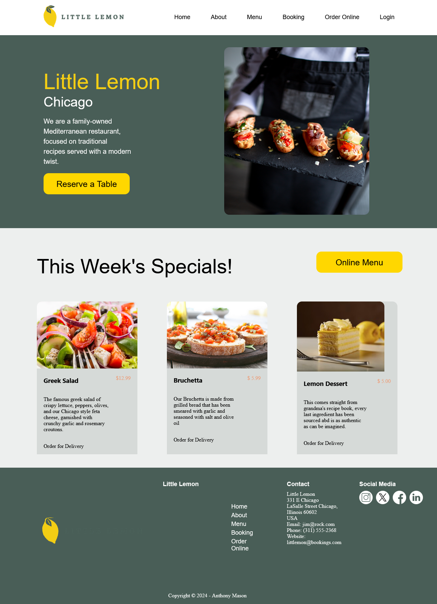
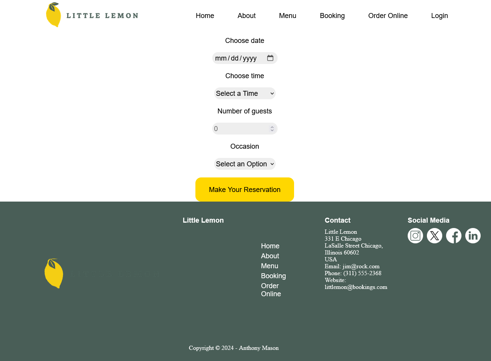
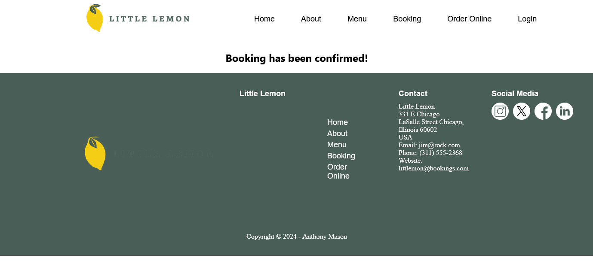

# Little Lemon Booking Website

## Project Description
This project was created during Meta's Coursera Front-End Development course as part of the capstone project.

This website showcased implementing a booking application on the Little Lemon Website. This was created with React Components to show an understanding of utilizing React for creating the website. This also features utilzing API calls.

Please note: the only functionality working on this website besides the design is the Reserve a Table function.

## Screenshots
Here are some screeenshots of the application showcasing the Booking functionality.

  
